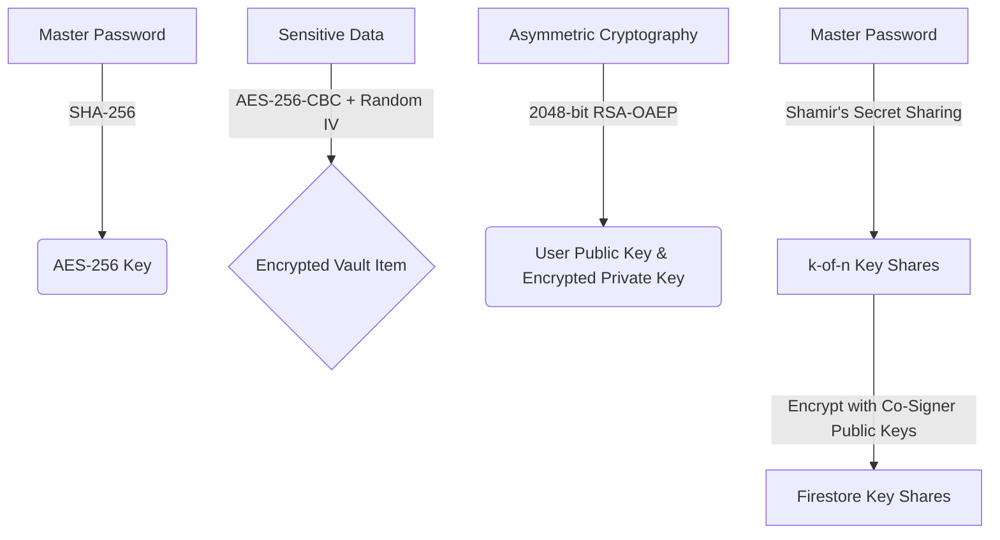

# 🛡️ Legacy Vault — Cryptographically Secure Digital Estate Planning & Multi-Sig Inheritance Platform

Legacy Vault is a state-of-the-art, professional-grade digital estate planning and multi-signature inheritance platform. It bridges the gap between digital asset custody and inheritance law, allowing users to securely store sensitive digital credentials, passwords, medical records, and video messages, which are only released to designated beneficiaries upon death validation via a decentralized, multi-signature consensus protocol or certified death claim administrative verification.

The platform consists of a **React Web Application** and a **Flutter Mobile Application** aligned with **100% cryptographic parity** and operating under a strict **Zero-Knowledge Architecture**.

---

## 🔒 Security & Cryptographic Architecture

Legacy Vault is built on a zero-knowledge trust model. All data encryption, decryption, asymmetric key generation, and secret splitting happen purely client-side on the user's local device sandbox. No plain text credentials, private keys, or raw secret shares are ever uploaded to Firestore, cloud servers, or external networks.



### 1. Client-Side Symmetric Encryption (AES-256-CBC)
* Deterministic 256-bit AES keys are derived locally using a **SHA-256 hash** of the user's master password.
* Encrypted payload format: `Base64(IV [16-bytes] + Ciphertext [bytes])`.
* A cryptographically secure random 16-byte Initialization Vector (IV) is generated for each encryption operation to guarantee semantic security (identical plain text produces completely different ciphertexts every time).

### 2. Client-Side Asymmetric Cryptography (2048-bit RSA-OAEP)
* Upon registration or settings check, both clients automatically generate a unique **2048-bit RSA keypair** using the Web Crypto API (Web) and PointyCastle (Mobile).
* The **Public Key** is stored in Firestore as a standard SubjectPublicKeyInfo (SPKI) Base64 ASN.1 DER structure.
* The **Private Key** is symmetrically encrypted client-side using the user's master password (AES-256-CBC) and stored in Firestore as a PrivateKeyInfo (PKCS#8) Base64 ASN.1 DER structure.
* This architecture ensures complete cross-platform interoperability: keys generated on Flutter are fully readable and functional on React, and vice versa.

### 3. Shamir's Secret Sharing (SSS) over Galois Field $GF(256)$
* To prevent any single point of failure or backdoors, the owner's master password can be split into $n$ separate key shares, requiring a threshold of $k$ co-signers ($k \le n$, minimum 2) to reconstruct the vault.
* **Galois Field Arithmetic**: Operations are performed over $GF(256)$ using primitive polynomial $x^8 + x^4 + x^3 + x^2 + 1$ (0x11D) to prevent algebraic data leaks and ensure absolute mathematical safety.
* **Asymmetric Share Shielding**: Every generated share is individually encrypted using the designated co-signer's **RSA Public Key** before being uploaded to Firestore. Only the target co-signer can decrypt their assigned share using their local RSA private key.
* **Lagrange Interpolation**: Reassembling $k$ decrypted shares reconstructs the deceased owner's master password via Lagrange polynomial interpolation, allowing the heir to safely decrypt the inherited vault items.

---

## 📱 Platform Parity

### Web Client (React + Vite + Tailwind CSS)
* **Fintech KYC Onboarding**: Premium 3-step registration capturing names, verified emails, phone details, and password strength metrics.
* **Dynamic Landing Page**: Modern corporate portal showing capabilities, security standards, and direct death claim filing routes.
* **Administrative Settlement Console**: Fully-equipped claim review board where verified administrators can inspect certified death certificates and trigger immediate cryptographic release of inherited vaults.

### Mobile Client (Flutter + Dart)
* **Secure Sandbox Storage**: Master password cache is stored only during active sessions inside `FlutterSecureStorage` (Keychain on iOS, Keystore on Android) and instantly wiped on logout.
* **Co-Signer Dashboard**: Real-time multi-sig tracking displaying pending approval counts, progress indicators, and approve/reject triggers.
* **Interactive SSS Recovery Console**: Guided decryption modal that decrypts the heir's share, captures other co-signers' shares, runs Lagrange interpolation, and renders the decrypted inherited vault.

---

## 🛠️ Installation & Setup

### Web App
```bash
cd web_app
npm install
npm run dev
```

### Mobile App
```bash
# Verify unit tests & cryptographic correctness
flutter test

# Verify build assets
flutter build bundle
```

---

## 🛡️ License & Patents
Legacy Vault is designed as a secure, decentralized digital asset protection standard. The zero-knowledge Shamir's Secret Sharing (SSS) key splitting framework and multi-signature consensus protocol are developed under strict open-source security guidelines.
